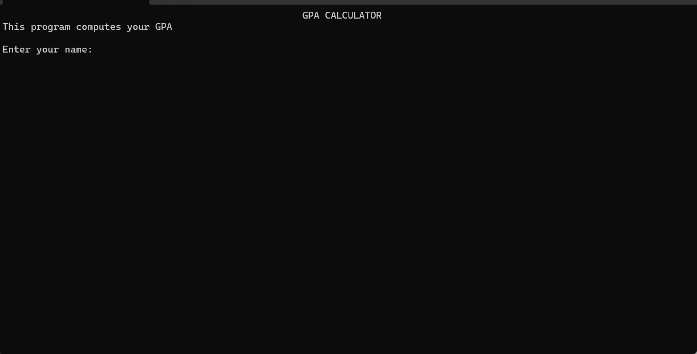

## GPA Calculator

## Project Overview
This is a console application designed to calculate and display a user's Grade Point Average (GPA). Developed using C#, it demonstrates my proficiency in programming fundamentals, including essential syntax and structures. Leveraging classes, methods, and interfaces, it showcases my understanding and application of object-oriented principles. Users enter their course details one by one—name, code, unit, and score. This helps the calculator grade dynamically and calculate the GPA, showing the final result.

## Demo

